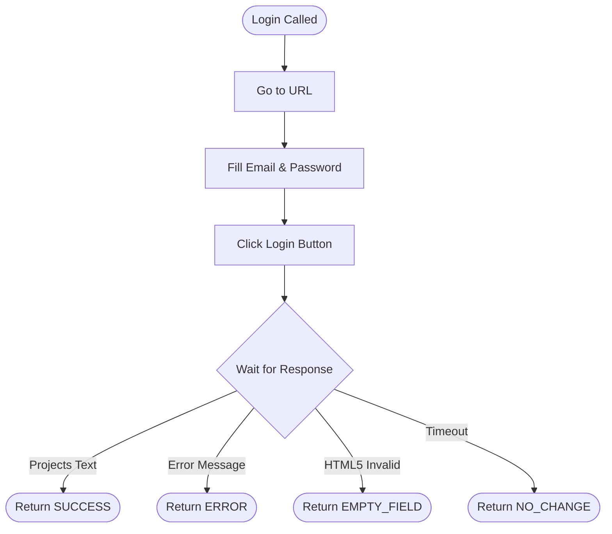
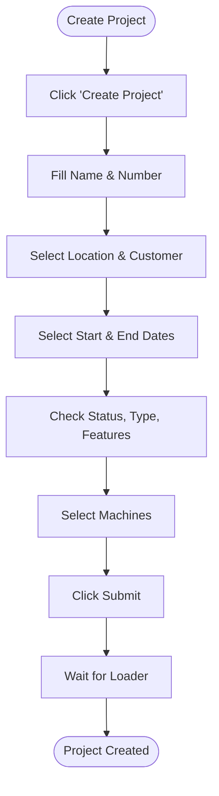
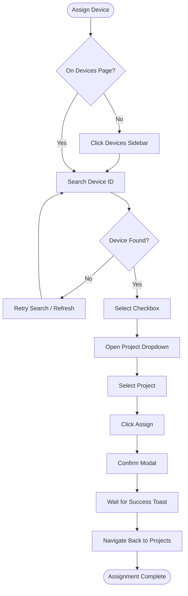
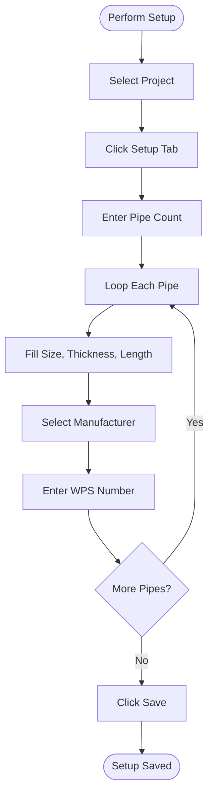

# Automation Flow Diagrams

This document visualizes the logic flow for each Page Object and the Main Test Runner.

## 1. Main Test Runner (`production-flow.spec.js`)

```mermaid
graph TD
    Start([Start Test]) --> Init[Load Config & Helpers]
    Init --> Clean{Clean Exports?}
    Clean -- Yes --> DeleteFiles[Delete Old Excel Files]
    Clean -- No --> CheckSource
    DeleteFiles --> CheckSource{Check Source File?}
    CheckSource -- Yes --> ValidateFile[Validate .txt Exists]
    CheckSource -- No --> Extractor
    ValidateFile --> Extractor{Run Extraction?}
    Extractor -- Yes --> GenActual[Generate ActualData Excel]
    Extractor -- No --> LoginStep
    GenActual --> LoginStep{Login?}
    LoginStep -- Yes --> PerformLogin[Login & Open Project]
    LoginStep -- No --> CreateStep
    PerformLogin --> CreateStep{Create Project?}
    CreateStep -- Yes --> NewProject[Create New Project UI]
    CreateStep -- No --> DevReg
    NewProject --> DevReg{Device Registration?}
    DevReg -- Yes --> Step1[Run Step 1: Capture ID]
    Step1 --> Step1Wait[Wait for ID in Config]
    Step1Wait --> Assign[Assign Device to Project]
    Assign --> DevReg
    DevReg -- No --> SetupStep
    SetupStep{Setup?}
    SetupStep -- Yes --> ApplyDerived[Apply Derived Config]
    ApplyDerived --> PerformSetup[Fill Setup Tab]
    PerformSetup --> SyncStep
    SetupStep -- No --> SyncStep
    SyncStep{Device Sync?}
    SyncStep -- Yes --> RunStep2[Run Step 2: DB Sync]
    RunStep2 --> ProdStep
    SyncStep -- No --> ProdStep
    ProdStep{Production Analysis?}
    ProdStep -- Yes --> OpenProj[Open Project]
    OpenProj --> ProdTab[Go to Production Tab]
    ProdTab --> LoopSlope[Loop Slope Combinations]
    LoopSlope --> ApplyStatus[Apply Status Config]
    ApplyStatus --> RunAnalysis[Extract UI Data]
    RunAnalysis --> Compare{Comparison?}
    Compare -- Yes --> RunCompare[Compare Excel Files]
    RunCompare --> NextSlope
    Compare -- No --> NextSlope
    NextSlope --> LoopSlope
    ProdStep -- No --> End([End Test])
```



---

## 2. Login Page (`LoginAndProjectPage.js`)



---

## 3. Create Project Page (`CreateProjectPage.js`)



---

## 4. Device Assigning Page (`DeviceAssigningPage.js`)



---

## 5. Setup Page (`setup.page.js`)



---

## 6. Production Tab Extraction (`ProductionTabWeldData.page.js`)

```mermaid
graph TD
    Start([Run Analysis]) --> Scroll[Scroll Table to Load]
    Scroll --> Capture[Capture Visible Weld IDs]
    Capture --> Loop[Loop Each Weld ID]
    Loop --> Search[Search & Filter Weld ID]
    Search --> ClickEye[Click Eye Icon]
    ClickEye --> Summary[Extract Weld Summary]
    Summary --> Tabs[Loop Configured Tabs (Pass/Zone/Tilt)]
    Tabs --> ExtractView[Extract Main View Table]
    ExtractView --> TLogs{T-Logs Enabled?}
    TLogs -- Yes --> ClickRowEye[Click Row Eye]
    ClickRowEye --> ExtractAnalysis[Extract Data Analysis Table]
    ExtractAnalysis --> Back[Go Back]
    TLogs -- No --> NextTab
    Back --> NextTab{More Tabs?}
    NextTab -- Yes --> Tabs
    NextTab -- No --> Clear[Clear Search]
    Clear --> Save[Save Excel]
    Save --> NextWeld{More Welds?}
    NextWeld -- Yes --> Loop
    NextWeld -- No --> End([Analysis Complete])
```

---

## 7. BoltDB Extraction (`BoltDBTxtFileTOExcel.page.js`)

```mermaid
graph TD
    Start([Run Extraction]) --> Read[Read .txt File]
    Read --> Parse[Parse JSON Lines]
    Parse --> Session[Group into Sessions (S/T/C Records)]
    Session --> Loop[Loop Each Session]
    Loop --> Slope[Apply Slope Logic (In/Out)]
    Slope --> Map[Map Data Fields]
    Map --> Store[Store in Memory]
    Store --> NextSession{More Sessions?}
    NextSession -- Yes --> Loop
    NextSession -- No --> Sheets[Generate Excel Sheets]
    Sheets --> SetupSheet[Write Setup Sheet]
    SetupSheet --> ViewSheets[Write View Sheets (Pass/Zone/Tilt)]
    ViewSheets --> AnalysisSheets[Write Analysis Sheets]
    AnalysisSheets --> Save[Save ActualData.xlsx]
    Save --> End([Extraction Complete])
```

---

## 8. Comparison Logic (`compare.page.js`)

```mermaid
graph TD
    Start([Run Compare]) --> FindFiles[Find Latest Actual & Production Excel]
    FindFiles --> Load[Load Workbooks]
    Load --> Loop[Loop Production Sheets]
    Loop --> Match[Find Matching Actual Sheet]
    Match --> Keys[Identify Key Columns (Weld ID, etc.)]
    Keys --> RowLoop[Loop Production Rows]
    RowLoop --> Lookup[Find Corresponding Actual Row]
    Lookup --> Diff[Compare Cell Values]
    Diff --> Mark[Mark Pass/Fail & Highlight Diff]
    Mark --> NextRow{More Rows?}
    NextRow -- Yes --> RowLoop
    NextRow -- No --> Summary[Update Summary Dashboard]
    Summary --> NextSheet{More Sheets?}
    NextSheet -- Yes --> Loop
    NextSheet -- No --> Save[Save Final_Comparison.xlsx]
    Save --> End([Comparison Complete])
```

---

## 9. Device Registration Script (`device_register.js`)

```mermaid
graph TD
    Start([Start Script]) --> Args[Parse Arguments (--step)]
    Args --> Step1{Step 1?}
    Step1 -- Yes --> FindExe1[Find Registration EXE]
    FindExe1 --> Run1[Spawn Process]
    Run1 --> Capture[Capture 'DESKTOP-' ID]
    Capture --> SaveConfig[Save ID to Combinations.json]
    SaveConfig --> Kill1[Kill Process Tree]
    Step1 -- No --> Step2
    Kill1 --> Step2{Step 2?}
    Step2 -- Yes --> FindFiles[Find EXE, DB, Param Files]
    FindFiles --> Clean[Delete Old .lock Files]
    Clean --> Run2[Spawn Sync Process]
    Run2 --> Monitor[Monitor Output]
    Monitor --> Success{Success Msg OR MQTT Count > 3?}
    Success -- Yes --> Kill2[Kill Process Tree]
    Kill2 --> Cleanup[Delete .db.lock]
    Cleanup --> End([Script Finished])
```